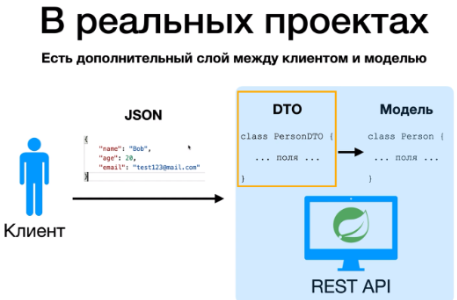
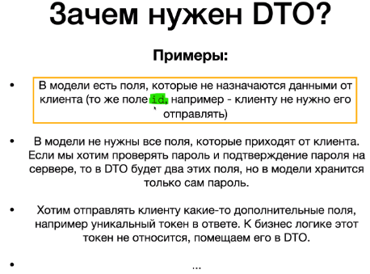

`DTO` позволяет нам указать только те поля которые хотим отправить или наоборот клиент должен отправить еще какое-то
дополнительное поле.

* В таком случае если у нас есть `DTO` мы можем изменить это и при этом `Model` останется не изменой.
* Или наоборот, хотим поменять Model и не хотим что-бы клиент отправлял какие-то другие данные мы можем поменять
  нашу `Model` бизнес-логику и при этом не менять `DTO`.

1. Пример когда DTO содержит меньше полей чем Model: `id` в **DTO** не будет, только в **Model**.
2. Пример когда DTO содержит больше полей чем Model: Представим хотим проверять пароль и подтверждение пароля на стороне
   сервере (где надо в 2 ячейки ввести пароли что-бы они совпали). То в DTO будет пароль и подтверждение пароля НО мы не
   хотим хранить в Model 2-раза пароль, а только сам пароль единожды.
   
   

```postgresql
CREATE TABLE Person
(
    id    int GENERATED BY DEFAULT AS IDENTITY PRIMARY KEY,
    name  varchar(100) NOT NULL,
    age   int,
    email varchar(100)
);

INSERT INTO Person(name, age, email)
VALUES ('Tom', 25, 'tom@mail.com');
INSERT INTO Person(name, age, email)
VALUES ('Bob', 51, 'bob@mail.com');
INSERT INTO Person(name, age, email)
VALUES ('Katy', 38, 'katy@mail.com');

alter table Person
    add column created_at timestamp,
    add column updated_at timestamp,
    add column created_who varchar;
```